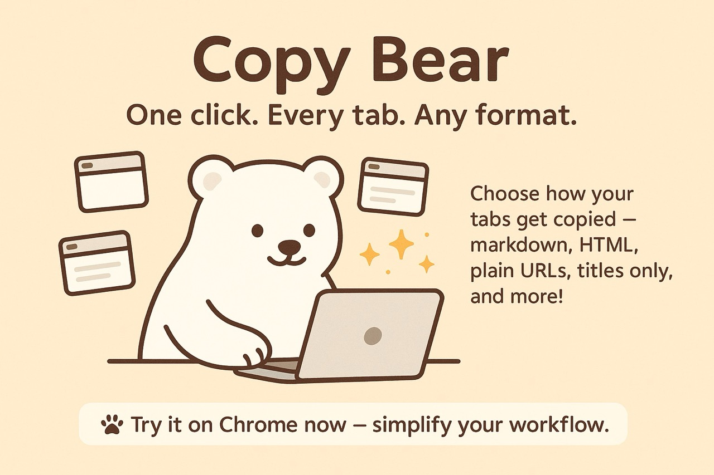

## 🐻 Copy Bear — One‑click custom copy for your tabs

**One single purpose:** copy selected tab(s) title, URL, and any selected text etc in exactly the format you like — with just one click on the action button.



<a href="https://buymeacoffee.com/riiiiiiiiiina" target="_blank"></a>

### Why you’ll love it

- **One click, done**: No fiddling. Click the bear, your text is ready to paste.
- **Your format, your vibe**: Markdown, plain text, multi‑line… totally up to you.
- **Works on many tabs**: Select multiple tabs and copy them all at once.
- **Grabs selected text**: If you highlight text on a page, it’s included as a quote.

### How it works

- **Single click**: Copies using your Single‑click format (default is Title + Url in 2 lines).
- **Double click**: Copies using your Double‑click format (default is Title + Url in markdown).
- **Triple click**: Copies using your Triple‑click format (default is Title + Url in 1 line).
- **Multi‑tab**: Select several tabs first, then click the bear to copy them all.

Default shortcut: `Cmd+Shift+1` on macOS, `Ctrl+Shift+1` on Windows/Linux.

### Custom formats (tiny magic)

Use placeholders to build your perfect output:

- `<title>`: the tab’s title
- `<url>`: the tab’s URL
- `<quote>`: the text you selected on the page (if any)
- `\n`: new line

Examples:

```text
<title>\n<url>
```

```text
[<title>](<url>) — <quote>
```

```text
<title> - <url>
```

### Set up your formats

1. Right‑click the bear icon → Options, or open the extension’s Options page.
2. Choose what each click does: Single, Double, Triple.
3. Pick a preset or write your own custom format.
4. Save. That’s it!

### Privacy

Copy Bear works locally in your browser. No account. No tracking. No data leaves your device.

### Permissions, briefly

- **activeTab, tabs**: read the current tab(s) title/URL.
- **clipboardWrite**: copy to your clipboard.
- **storage**: save your formats and preferences.

### Tips

- Select several tabs with Shift/Cmd/Ctrl, then click the bear to copy them all.
- If no text is selected on a page, `<quote>` simply becomes empty.

Have a cute idea for a preset? Share it with the bear 💌
